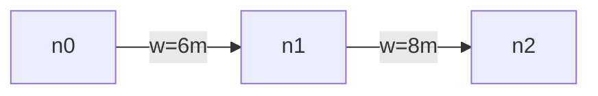

# Terrain tools (L7)

Three live-Workbench wrappers that dispatch into the `EMCP_WB_Terrain.c` Enforce-side handler over the NET API TCP protocol. Each is a thin Node-side adapter — the heavy lifting happens inside the Workbench plugin.

**Status:** The Enforce handler in `mod/Scripts/WorkbenchGame/EnfusionMCP/EMCP_WB_Terrain.c` ships with only the `getHeight`, `getBounds`, and `inspect` actions wired through to real Workbench APIs. The remaining actions (`navmesh_status`, `navmesh_bake`, `export_heightmap`, `road_export_graph`, `river_export`, `water_surface_query`, `save_world_as`) are **placeholders that return `status: "not_implemented"`**. The Node-side wrappers handle that response gracefully — calling these tools today gives a structured "not yet implemented" message pointing back at `docs/L7-PLAN.md`, not an opaque error.

Full wiring of the placeholder actions requires Workbench-side API exploration (`NavmeshWorldComponent`, `RoadNetworkManager`, `RiverEntity`, `ChimeraWorldUtils`, `GameWorldEditor`) — this is the next-session deliverable from `docs/L7-PLAN.md` §L7-1.

## Common preconditions

- **Workbench must be running** with a world open in Edit mode (`wb_launch` brings it up automatically if not).
- **EMCP_WB_Terrain.c handler must be deployed** to the active mod's `Scripts/WorkbenchGame/EnfusionMCP/` directory. `wb_launch` does this automatically; `wb_cleanup` removes it.
- **The NET API must be enabled** in Workbench (File → Options → General → Net API).

If the handler isn't deployed, the tools surface a clear `EMCP_WB_Terrain handler not deployed` message rather than an opaque RPC timeout.

## terrain_inspect

Returns an aggregated summary of a world's terrain: bounds, tile count, layer textures, road / river counts, biome, and last-navmesh-bake timestamp. Today the live handler returns only `bounds` and echoes back the `world_path`; the remaining fields surface as placeholders until the deeper Workbench API queries are wired in.

**Input:**

```json
{ "world_path": "worlds/MP/MyMap.ent" }
```

**Sample output (excerpt):**

```
## terrain_inspect: worlds/MP/MyMap.ent

- **Bounds:** {"min":[-4096,0,-4096],"max":[4096,512,4096]}
```

**Known limits:**

- L7-placeholder shape — full data set (`tile_count`, `layer_textures`, `road_count`, `river_count`, `biome`, `navmesh_last_baked`) requires the handler to wire into `GenericTerrainEntity` + `RoadNetworkManager` + `NavmeshWorldComponent`.
- World must already be loaded in the editor — the tool doesn't open worlds automatically. Use `wb_open_resource` first if needed.
- Returns the inspect payload as JSON inside a markdown text response, not structured content.

## terrain_navmesh_status

Reports navmesh tile coverage for a world: loaded / valid / requested counts plus bake recency. Designed for pre-flight checks before a multiplayer scenario goes live.

**Input:**

```json
{ "world_path": "worlds/MP/MyMap.ent" }
```

**Sample output (current — placeholder):**

```
Navmesh status query is not yet implemented in the Workbench-side handler.
Tracking: docs/L7-PLAN.md (L7-1 EMCP_WB_Terrain navmesh_status).
Underlying message: Action 'navmesh_status' is planned for L7 but not yet implemented.
```

**Sample output (target — once handler ships):**

```
## terrain_navmesh_status: worlds/MP/MyMap.ent

- **loaded_tiles:** 412
- **valid_tiles:** 408
- **requested_tiles:** 412
- **invalid_tiles:** 4
- **last_baked:** 2026-04-12T18:33:21Z
```

**Known limits:**

- Placeholder until the handler dispatches to `NavmeshWorldComponent.IsTileLoaded / IsTileValid / IsTileRequested` over a tile grid spanning the world bounds.
- A long-running tile sweep on a large map may exceed the NET API's default timeout once wired — `docs/L7-PLAN.md` §L7-2 specifies driving long-running queries through `JobStore` to address this.

## terrain_road_export_graph

Exports the world's road network as a graph (nodes + edges + widths). Output is either raw JSON or a Mermaid graph for visualization. Use for mission-planning audits (where can vehicles drive?) or road-validation runs against the route plans embedded in scenarios.

**Input:**

```json
{ "world_path": "worlds/MP/MyMap.ent", "format": "json" }
```

**Sample output (current — placeholder):**

```
Road graph export is not yet implemented in the Workbench handler.
Tracking: docs/L7-PLAN.md (L7-1 EMCP_WB_Terrain road_export_graph).
Will use RoadNetworkManager.GetRoadsInAABB once wired.
```

**Sample output (target — once handler ships, `format: "json"`):**

````
## terrain_road_export_graph: worlds/MP/MyMap.ent (json)

```json
{
  "nodes": [
    {"id": "n0", "x": -123.4, "z": 456.7},
    {"id": "n1", "x":  240.0, "z": 510.2}
  ],
  "edges": [
    {"from": "n0", "to": "n1", "width": 6.0, "road_id": "RD_0042"}
  ]
}
```

Nodes: 2, Edges: 1
````

**Sample output (target, `format: "mermaid"`):**

````
## terrain_road_export_graph: worlds/MP/MyMap.ent (mermaid)


````

**Known limits:**

- Placeholder until the handler dispatches to `RoadNetworkManager.GetRoadsInAABB` + per-road `GetPoints` + `GetWidth`.
- Mermaid output truncates rapidly past ~50 nodes — fall back to `format: "json"` for large maps.
- Intersection detection is the handler's responsibility; the Node-side just renders.
- Doesn't include junction prefab refs, traffic-direction metadata, or per-segment surface types — those are out of scope for v1 of the graph export.

## Why three tools instead of one

The terrain cluster could have been one omnibus `terrain` tool with an `action` field, mirroring the Enforce-side dispatch. The Node-side intentionally splits into three so:

1. **LLM tool-picking** works against tight, single-purpose tool descriptions rather than one mega-tool with a huge enum.
2. **Future schema divergence** is cheap — `terrain_road_export_graph` already has a `format: "json" | "mermaid"` field that wouldn't fit cleanly on a shared schema.
3. **Per-tool error UX** stays consistent — each tool reports its own "not yet implemented" message linking back to the exact L7-PLAN section.

The Enforce-side dispatcher pattern is documented in `docs/L7-PLAN.md` §L7-1 (one handler per domain, `action` field as discriminator, hard cap ≤15 handler files at v1.0.0).
